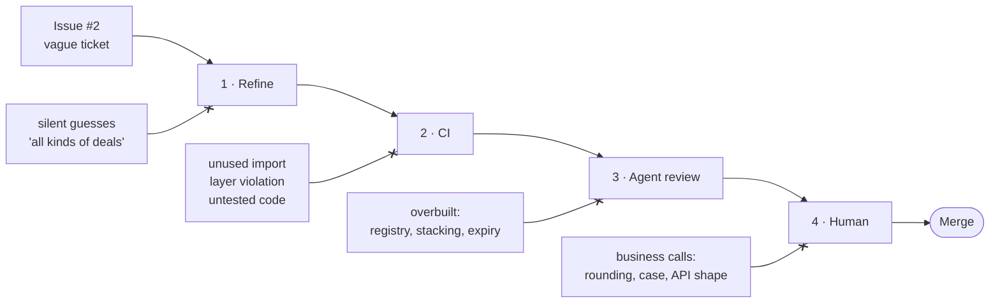

# Why four layers, not one good one

No single check catches everything. Each one has holes, and you can't predict where they'll be.
What you *can* do is stack layers whose holes don't line up, so a defect that slips through one
gets stopped by the next. That is the **Swiss cheese model**: build defence in depth instead of
trying to make one layer perfect
([CS146S · The Modern Software Developer](https://themodernsoftware.dev/), week 1).

Each defect in the diagram above is real, and each one appears in this repo's demo. Each one got
**through** every layer to the left of the one that stopped it. For example, the overbuilt code
passed CI with 100% coverage.

## Every layer has a hole

| Layer | What it stops | Its hole | Covered by | See it |
|---|---|---|---|---|
| **1 · Refine** | Silent guesses. The agent asks before it builds | The answers can be wrong or incomplete | Review against the spec, then a human | [Issue #2](https://github.com/limsijie93/tt-masterclass-agentic-sdlc-lite/issues/2) |
| **2 · CI** | Lint, layering, missing tests. Same verdict every time | Can't tell whether it's the *right* code: overbuilt code still goes green | Agent review | [PR #1](https://github.com/limsijie93/tt-masterclass-agentic-sdlc-lite/pull/1/files), [PR #3 checks](https://github.com/limsijie93/tt-masterclass-agentic-sdlc-lite/pull/3/checks) |
| **3 · Agent review** | Scope creep and needless abstraction, judged against the spec | Non-deterministic, and often wrong (see below) | It only comments; a human decides | [`review-pr`](../.claude/skills/review-pr/SKILL.md), [PR #3](https://github.com/limsijie93/tt-masterclass-agentic-sdlc-lite/pull/3) |
| **4 · Human** | Business and domain calls that no spec settled | Limited attention, spent reading top to bottom | `pr-focus` points them at the 2–3 places that matter | [`pr-focus`](../.claude/skills/pr-focus/SKILL.md), [PR template](../.github/pull_request_template.md) |

Two rules follow from the table:

1. **Never spend a layer's attention on something an earlier layer can catch.** CI costs seconds,
   an agent review costs minutes, and a human costs the most. That's why `review-pr` is told to
   skip anything CI already checks.
2. **Only deterministic layers block.** An agent's verdict can change between runs, so it
   comments and a human decides. A gate that flakes gets switched off, and then its hole is the
   whole layer.

## Why the agent layer only comments

Semgrep pointed two coding agents at real web applications to look for security bugs
([Semgrep, 2025](https://semgrep.dev/blog/2025/finding-vulnerabilities-in-modern-web-apps-using-claude-code-and-openai-codex/)):

- **Not repeatable:** running the exact same prompt on the exact same codebase often gave
  *"vastly different results"*.
- **Mostly wrong:** one agent made 46 findings with a **14%** true-positive rate. The other made
  21 findings at **18%**.

That's a security study rather than a design review, but the lesson carries over. An agent
reviewer is a useful second pair of eyes and a bad merge gate. It belongs in layer 3: advisory,
in a fresh session, with a human deciding.
